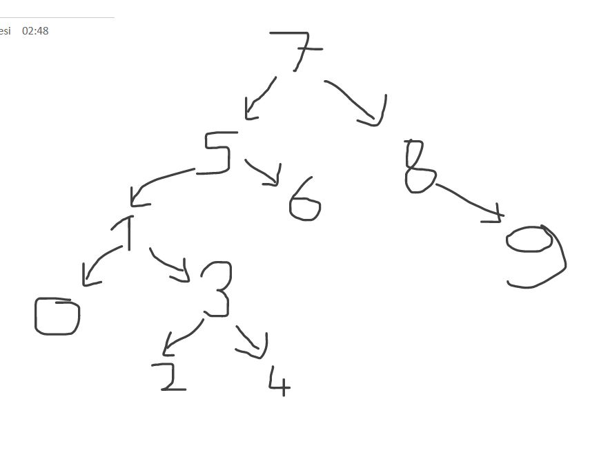

# Binary Search Tree Projesi
------------
## Soru
Proje 3
[7, 5, 1, 8, 3, 6, 0, 9, 4, 2] dizisinin Binary-Search-Tree aşamalarını yazınız.

Örnek: root x'dir. root'un sağından y bulunur. Solunda z bulunur vb.

## Çözüm

*Dizide Aramaya başlamak için root bir sayı belirlememi gerekiyor.*

Root 7 olarak belirleyelim.

Root'un sağında 5,1,3,6,0,4,2 bulunur.

Root'un solunda 8,9 bulunur.

